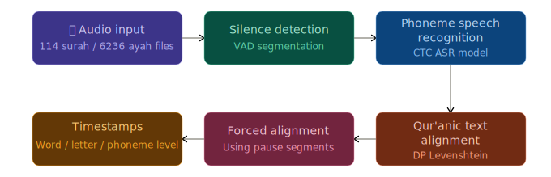

<h1 align="center">Qur'anic Universal Audio</h1>

  
  
  
  
  
  
  

The all-in-one audio and timing hub for Qur'anic apps, developers, and researchers. A one-stop, community-verified dataset providing large-scale, multi-riwayah recitations, timestamped at the word- and letter-level. Our automated pipeline transforms surah or ayah recordings into precise, waqf-aware Qur'anic transcripts and timestamps, with robust human-in-the-loop verification.

  

https://github.com/user-attachments/assets/b81e805b-129e-4be9-af51-94d3babd4bd2

## Use Cases

- **Word-highlighted recitation** — Accurate word and letter timestamps for highlighting in Qur'an apps, learning tools, and educational platforms.
- **Generate EveryAyah style audio from surah recordings** — Extract per-ayah audio clips from full-surah recordings, producing verse-by-verse files for any reciter even when only surah-level audio exists.
- **Tajweed timing analysis** — Subword-level timestamps let you measure durations of tajweed rules (e.g. madd and ghunnah lengths) across expert reciters.
- **Unified multi-reciter audio access** — Browse and access audio from hundreds of reciters across multiple sources through a single unified format with consistent JSON schemas.

## Components

| Component | Description |
|-----------|-------------|
| [`data/`](data/) | Reference data, audio manifests, alignment output, and timestamps, alongside schemas and documentation |
| [`quran_multi_aligner/`](quran_multi_aligner/) | Hugging Face space demonstrating the full pipeline with free GPU processing, also available as an [API](quran_multi_aligner/docs/client_api.md) |
| [`mfa_aligner/`](mfa_aligner/) | MFA forced alignment service for timestamps computation |
| [`inspector/`](inspector/) | Flask web app for browsing, validating, and editing alignment results |
| [`validators/`](validators/) | CLI scripts for validating audio inputs, segments, and timestamps |
| [`reciter_requests`](https://huggingface.co/spaces/hetchyy/Quran-reciter-requests) | Community request form and system for new reciter processing |
| [quranic-phonemizer](https://github.com/Hetchy/Quranic-Phonemizer) | External package — Quran-specific G2P; the foundation that makes phoneme-level alignment possible |

## Key Highlights

- **Tajweed- and Phoneme-level precision:** We bypass standard word alignment by aligning at the phoneme level first, recovering clean, precise word boundaries. Tajweed rules like idgham, where sounds merge at word boundaries, are resolved at the phoneme level, eliminating the ambiguity of where one word ends and the next begins.

- **Gap-free timestamps** — As segments have no pauses, word timestamps are padded to eliminate artificial gaps and reflecting natural word continuity in recitations. Highlighting stays perfectly synchronized with the audio—no silent flickers or jarring jumps

- **Handles repetitions naturally** — Because the pipeline first segments by silences and then transcribes each segment independently, repeated words or verses are detected and timestamped correctly — each occurrence gets its own timestamps.

- **Robust validation and inspection** — Three dedicated validators check every stage of the pipeline, and the inspector UI makes it possible to review, edit, and correct AI errors, improving results instead of treating them as a black box.

- **Community-reviewed** — Unlike static dataset releases, this project is open for anyone to inspect, fix, and improve the data through the inspector and pull requests. Quality improves continuously as more people review and correct errors.

- **Full provenance and reproducibility** — Every output file records the models, parameters, and sources used to produce it via `_meta` blocks across all three pipeline stages — audio manifests (reciter, riwayah, source, audio category), segments (models, thresholds), and timestamps (alignment settings). Results are fully traceable and reproducible. Git versioning and Github Releases track all changes to the data over time.

See the [detailed comparison with QUL timestamps](docs/qul_vs_mfa_timestamps.md) for concrete examples of accuracy and robustness to repetitions.

## Accessing Data

If you're just here for the audio, timestamps or segment data, you can access them as follows:

1. **Direct download** — JSON files in [`data/`](data/), or packaged in [GitHub Releases](https://github.com/Wider-Community/quranic-universal-audio/releases)
2. **Hugging Face Dataset** — [quranic-universal-ayahs](https://huggingface.co/datasets/hetchyy/quranic-universal-ayahs)
3. **QUD API** — *(coming soon)*

## Contributing

This is a community project. The pipeline is automated, but manual review is essential to guarantee quality. No expertise in tajweed or recitation rules is needed — fixing errors means things like missing words, over/under-segmentation, and low-confidence segments, all done through the inspector UI.

See [CONTRIBUTING.md](CONTRIBUTING.md) for how to get started, or [open an issue](https://github.com/Wider-Community/quranic-universal-audio/issues) for bugs and feature requests.

## License

[Apache 2.0](LICENSE)
