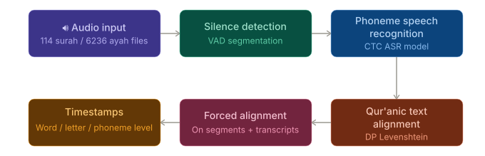

<h1 align="center">Qur'anic Universal Audio</h1>

  
  
  
  <!-- stats-badges:start -->
   
  
  
  
  <!-- stats-badges:end -->
   
  
  
  

The all-in-one audio and timing hub for Qur'anic apps, developers, and researchers. A timestamps visualizer, editing tool and community-verified dataset unifying recitations at scale with word- and letter-level timestamps.

  <a href="#key-highlights">Highlights</a> ·
  <a href="#use-cases">Use Cases</a> ·
  <a href="#data-access">Data Access</a> ·
  <a href="#technical-overview">How it works</a> ·
  <a href="#contributing">Contribute</a> ·
  <a href="#roadmap">Roadmap</a> ·
  <a href="#acknowledgements">Acknowledgments</a> ·
  <a href="#license">License</a>

## Highlights

- **Unified Qur'anic audio hub:** A single consistent schema with comprehensive metadata for reciters and recitations instead of scattered websites, CDN APIs, YouTube playlists, and raw files with different formats.

- **Large-scale, multi-riwayah, multi-style:** Full Qur'an coverage across many recitations and hours of audio, spanning mujawwad, murattal, muallim, taraweeh and children repeat styles.

- **Phoneme-based alignment:** 20ms phoneme-level precision yields maximum accuracy, eliminates ambiguity at word boundaries and disambiguates tajweed effects where sounds merge across words.

- **Repetition-aware, gap-free timestamps:** The pipeline transcribes each silence-based segment independently, so repeated words are detected and timestamped correctly. See the [comparison with QUL timestamps](docs/qul_timestamp_comparison.md).

- **Community-driven validation:** No trusting a black-box pipeline. Every stage is automatically checked by dedicated validators and human-correctable through an interactive editing UI. Review flagged errors like missing words or misaligned boundaries, fix them visually, and feed corrections back into the dataset.

- **Submit your own recitations:** Add your favorite reciters and different audio sources to the catalog and we handle the processing — typically within a few days.

- **Metadata and versioning:** Each recitation is governed by consistent schemas and metadata and versioned with a full history to track segment updates and timestamp corrections over time.

## Use Cases

- **Verse playback** — play or seek any ayah or ayah range straight from the original surah audio.
- **Follow-along** — word-by-word highlighting synced to the recitation.
- **Word study** — replay the sound of individual words for learners.
- **Tajweed research** — measure ghunnah and madd durations from letter timestamps, study cross-word effects and silent-letter interactions, and support tajweed teaching.
- **ML research** — a large, diverse corpus (reciters, paces, styles, riwayat) for speech recognition, tajweed, recitation start/stop detection, and reciter identification.

## Data Access

Audio, timestamps and metadata ship in two open formats — pick by your use case.

| | [GitHub Releases](https://github.com/Wider-Community/quranic-universal-audio/releases) | [Hugging Face Dataset](https://huggingface.co/datasets/hetchyy/quranic-universal-ayahs) |
|---|---|---|
| **Best for** | Apps, offline use, archives | ML research, analysis, direct audio access |
| **Shape** | JSON per recitation, in ayah / word / letter tiers | Parquet, one row per ayah |
| **Audio** | Not bundled — original surah URLs in `catalog.json` | Embedded per-ayah clip in every row + original URLs |
| **Versioning** | Version-pinned snapshots, reproducible | Rolling — always the latest |
| **Fetch what you need** | Full release or specific reciters | Full dataset or specific reciters, Hugging Face supported live viewer, filtering and querying |

Both formats support both gapless surah and ayah-by-ayah playback. Both ship a single take per full ayah (the first occurrence), so in rare cases where a reciter repeats an ayah fully or partially at the ayah start/end, follow-along highlighting may pause until they move past the repetition (within-ayah repetitions are still preserved). A unified API — which also exposes the full, unfiltered duplicates — is on the [roadmap](#roadmap).

## Technical Overview

  

| Component | Description |
|-----------|-------------|
| [`Quranic Universal Aligner`](https://huggingface.co/spaces/hetchyy/quranic-universal-aligner) | Demo running on Hugging Face GPU demonstrating our alignment toolkit, also available via [API](docs/client_api.md) |
| [`inspector/`](inspector/) | Entry website for browsing reciters, viewing timestamps interactively and editing alignment results |
| [quranic-phonemizer](https://github.com/Hetchy/Quranic-Phonemizer) | External package — Qur'an-specific G2P; the foundation that allows phoneme-level alignment |

## Contributing

Visit the [website](https://hetchyy-quranic-universal-audio.hf.space/) and read the overview info and editing guide to get started in contributing recitations and fixing alignment errors.

Issues and pull requests are welcome. If you've found a bug or have a feature idea, open an [issue](https://github.com/Wider-Community/quranic-universal-audio/issues) or jump into the Discord.

To contribute code to the repo directly, fork the repo and see [inspector/README.md](inspector/README.md) for setup instructions.

## Roadmap

**Access**

- [ ] **Unified API/SDKs** — typed Python/JS client (`pip`/`npm`) over the published QUA artifacts: fetches and caches only requested data, defaults to latest with optional pinning and offline vendoring, and exposes the schemas for type consistency. Complements the Releases + HF dataset.
- [ ] **Global CDN** — mirror all recitations and audio across regions, prewarmed with demand-based routing for low-latency delivery everywhere.

**Coverage + Quality**

- [ ] **100+ recitations** — reach 100+ fully aligned and verified recitations.
- [ ] **Letter-level precision** — word and letter timestamps are both high quality; close the few minor systematic and timing differences in letter timestamps that depend on context, tajweed, and reciter.

**Generalisation**

- [ ] **Orthography** — letter-level timestamps are currently tuned for Uthmani script (DigitalKhatt). Generalise to other scripts where symbols and letter conventions differ, e.g. IndoPak.
- [ ] **Riwayah** — extend beyond Hafs. Each riwayah has its own unique sounds, tajweed, symbols, and ayah orderings, with fewer and less reliable digital assets than Hafs.

## Acknowledgements

- **[Qur'anic Universal Library (QUL)](https://qul.tarteel.ai)** — Qur'an metadata, the Uthmani script, and the [DigitalKhatt](https://digitalkhatt.org) font.
- **Audio sources** — recitations are sourced from [QuranicAudio](https://quranicaudio.com), [EveryAyah](https://everyayah.com), [MP3Quran](https://mp3quran.net), [QUL](https://qul.tarteel.ai), [TVQuran](https://tvquran.com), [SurahQuran](https://surahquran.com), and [Way2Quran](https://way2quran.com).

## License

The project's own work — timestamps, segmentation, alignment, catalog metadata, and code — is licensed under [CC BY 4.0](LICENSE). Recitation recordings remain the property of their reciters and original upstream sources.