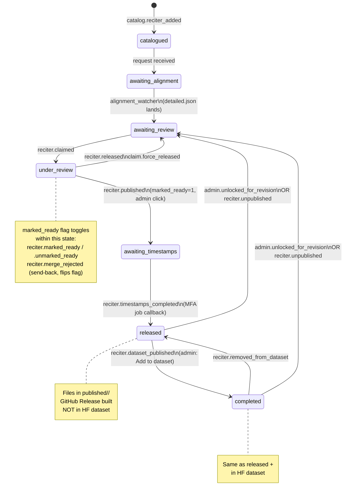

# Inspector v2 — Reciter state machine

Quick reference for the reciter lifecycle. Two views: what the public sees, and what admins see. For the events backing each transition, see [`inspector-state-management.md`](../inspector-state-management.md).

## Public lifecycle

Linear, no branches, no reverse arrows. Even when an admin unlocks a published reciter for revision, the public continues to see **Published** until the next publish lands — the revision is invisible externally.

## Admin state machine

Full internal state set with every transition that moves the state node. State-preserving actions (flag flips, file edits, metadata changes) are listed in the table below.

## State-preserving actions

These modify metadata, files, or flags without moving the state node:

| Action | Effect | Audit event |
|---|---|---|
| Send-back | `marked_ready` 1 → 0 on `under_review` | `reciter.merge_rejected` |
| Mark / unmark ready | `marked_ready` toggle on `under_review` | `reciter.marked_ready` / `.unmarked_ready` |
| Reassign claim | Swaps `assignee_hf_id` on `under_review` | `claim.reassigned` |
| Refresh timestamps | Re-enqueues MFA job; appends to `timestamps_job_ids` | `admin.batch_timestamps_refresh` |
| Direct admin edit | Writes to `published/<slug>/` while state stays `released` or `completed` | `published.edited` |
| Discard / undiscard | Flips `visibility` between `public` / `discarded` | `reciter.discarded` / `.undiscarded` |
| Catalog edit | Mutates reciter metadata in `reciter_catalog.json` | `catalog.reciter_edited` |
| Force-set-state | Direct state hop, allowed pairs only: `catalogued ↔ awaiting_alignment`, `awaiting_alignment ↔ awaiting_review`, `under_review → awaiting_review`, `awaiting_timestamps ↔ released` | `admin.force_set_state` |

## Internal ↔ public state mapping

| Internal | Public bucket |
|---|---|
| `catalogued` | Available for request |
| `awaiting_alignment` | Requested |
| `awaiting_review` | Available for review |
| `under_review` (`marked_ready=0`) | Under review |
| `under_review` (`marked_ready=1`) | Publishing |
| `awaiting_timestamps` | Publishing |
| `released` | Published |
| `completed` | Published |

## Automatic vs. manual transitions

| Automatic (system fires) | Manual (admin or contributor clicks) |
|---|---|
| `alignment.completed` (bucket watcher) | `reciter.claimed` / `.released` (contributor) |
| `reciter.timestamps_completed` (MFA job callback) | `reciter.marked_ready` / `.unmarked_ready` (contributor) |
| | `reciter.published` (maintainer Publish) |
| | `reciter.dataset_published` (maintainer "Add to dataset") |
| | All admin overrides: force-release, reassign, force-set-state, send-back, unlock, edit, refresh, remove-from-dataset, unpublish, discard |
